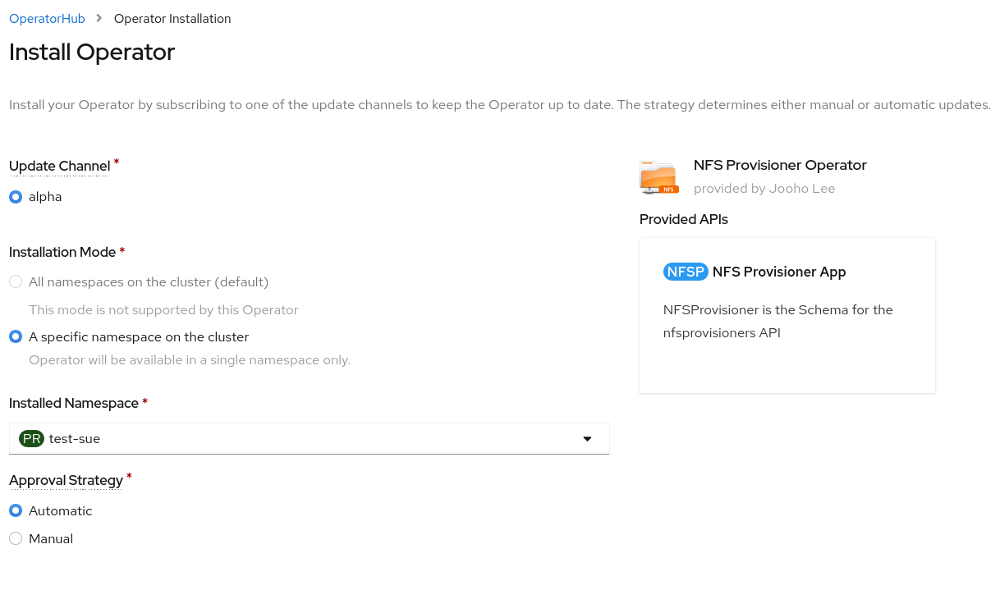

# ISV CLI Demo 1
## Environment
- [OpenShift 4.6 on openstack](https://console-openshift-console.apps.bell.tamlab.brq.redhat.com/)
- [NFS Provisioner Operator](https://github.com/Jooho/nfs-provisioner-operator)
- [Local Storage Operator](https://docs.openshift.com/container-platform/4.5/storage/persistent_storage/persistent-storage-local.html#local-storage-install_persistent-storage-local)
  
## Pre-requisites [Appendix 1](#appendix-1)
- Attach storage(50G) to [worker nodes](https://10.37.197.10/dashboard/project/instances/2f9e01da-19ec-42b1-9299-999318caf243/)
- Install local storage operator and create LocalVolume CR - [OpenShift Console](console-openshift-console.apps.bell.tamlab.brq.redhat.com)
- Create NFS Provisioner CatalogSource

## Flows
- *Sue* create a project `test-sue`
- *Joe*(cluster-admin) installs **NFS Provisioner** in test-sue for *Sue*(end-user)
- *Sue* creates NFS Provisioner CR
- Suppose NFS Provisioner have some issues.
- *Sue* goes to Installed Operator menu in Console and find MUST-GATHER part in the NFS Provisioner Operator Page
- Execute `isv-cli must-gather` command and downloaded tarball or data

## Step by step

### 1. *Sue* create a project `test-sue`.
  ~~~
  oc new-project test-sue
  ~~~

### 2. Joe(cluster-admin) installs NFS provisioner operator in the `test-sue` project
  
  

### 3. *Sue* creates NFS Provisioner CR
  ~~~
  echo "
  apiVersion: cache.jhouse.com/v1alpha1
  kind: NFSProvisioner
  metadata:
    name: nfsprovisioner-sample
  spec:
    storageSize: "1G"
    scForNFSPvc: local-sc
    SCForNFSProvisioner: nfs"|oc create -f -
  ~~~

### 4. *Sue* goes to Installed Operator menu in Console and find MUST-GATHER part in the NFS Provisioner Operator Page
  

**NOTE** `isv-cli` binaray can be accessible from internet and operator description share the link.

### 5. Execute `isv-cli must-gather` command and downloaded tarball or data
- Archiving
  ~~~
  isv-cli must-gather --image=quay.io/jooholee/nfs-provisioner-operator-must-gather:0.0.1
  ~~~

- No Archiving
  ~~~
  isv-cli must-gather --image=quay.io/jooholee/nfs-provisioner-operator-must-gather:0.0.1 --notar
  ~~~

### 6. event-filter.html
~~~
google-chrome ./must-gather.local.XXX/event-filter.html
~~~

### 7. Clean up
~~~
rm -rf ./must-gather.local*

oc delete sa,deployment,rolebinding -l app=must-gather
~~~

## Reference
- [isv-cli git repo](https://github.com/Jooho/isv-cli)
- [ISV Must-Gather White Paper](https://docs.google.com/document/d/1JahUFZFxhRIhsyOO6GB2d_yC8Ofn3M1y97kzmM4VtEw/edit#)
- [NFS Provisioner Operator Must Gather git repo](https://github.com/Jooho/nfs-provisioner-operator/tree/main/must-gather)
  

## Appendix
### Appendix 1
- Install local storage operator and create LocalVolume CR 
  ~~~
  export product-verion=4.6
  echo "
  apiVersion: v1
  kind: Namespace
  metadata:
    name: openshift-local-storage
  ---
  apiVersion: operators.coreos.com/v1alpha2
  kind: OperatorGroup
  metadata:
    name: openshift-local-operator-group
    namespace: openshift-local-storage
  spec:
    targetNamespaces:
      - openshift-local-storage
  ---
  apiVersion: operators.coreos.com/v1alpha1
  kind: Subscription
  metadata:
    name: local-storage-operator
    namespace: openshift-local-storage
  spec:
    channel: "${product-version}" 
    installPlanApproval: Automatic
    name: local-storage-operator
    source: redhat-operators
    sourceNamespace: openshift-marketplace" |oc create -f -

  oc project openshift-local-storage

  echo "
  apiVersion: "local.storage.openshift.io/v1"
  kind: "LocalVolume"
  metadata:
    name: "local-disks"
    namespace: "openshift-local-storage" 
  spec:
    nodeSelector: 
      nodeSelectorTerms:
      - matchExpressions:
          - key: kubernetes.io/hostname
            operator: In
            values:
            - worker-0.bell.tamlab.brq.redhat.com
            - worker-1.bell.tamlab.brq.redhat.com
            - worker-2.bell.tamlab.brq.redhat.com
    storageClassDevices:
      - storageClassName: "local-sc"
        volumeMode: Filesystem 
        fsType: xfs 
        devicePaths: 
          - /dev/vdb" | oc create -f -
  ~~~

- Create nfs-provisioner CatalogSource
  ~~~
  oc adm new-project openshift-managed-service

  cat <<EOF | oc apply -f -
  apiVersion: operators.coreos.com/v1alpha1
  kind: CatalogSource
  metadata:
    name: nfsprovisioner-catalog
    namespace: openshift-marketplace
  spec:
    sourceType: grpc
    image: quay.io/jooholee/nfs-provisioner-operator-index:0.0.1 
  EOF
  ~~~

