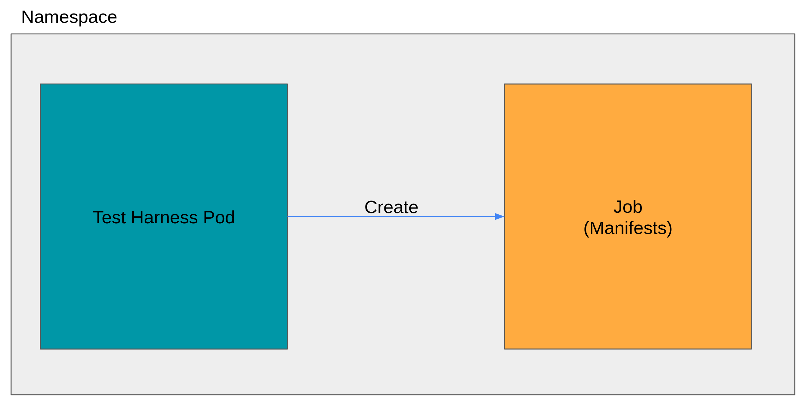

# Test Harness Create command

## Background
This cmd will create Test Harness and Manifests repositories. Test Harness repo will use Manifest image as a Job.




## Process after created 2 repositories

1. Manifests
First, you should take care of manifest repository.

* Update operator.sh
  ```
  vi $MANIFESTS_REPO/basictests/operator.sh

  # MUST UPDATE label (deploymentconfig=jupyterhub) and running pods count (1)
  %ERROR EXPECTED%

  ```

* Push the git repo 
  ~~~
  git init 
  git remote add origin https://github.com/$ORG/$MANIFESTS-NAME
  git add .;git commit -m "initial update"; git push --set-upstream origin master
  ~~~

* Test
  ~~~
  make build run
  ~~~

* Push the imagegit 
  ~~~
  make image
  ~~~

2. TEST Harness

* Do job test (this is using the manifests image)
  ~~~
  make job-test
  ~~~

* Clean job test
  ~~~
  make job-test-clean
  ~~~

* Push the git repo
  ~~~
  git init 
  git remote add origin https://github.com/$ORG/$TEST_HARNESS_NAME
  git add .;git commit -m "initial update";git push
  ~~~

* Build/Push an image
  ~~~
  make image
  ~~~

* Cluster Test
  ~~~
  make cluster-test
  ~~~

* Clean Cluster Test
  ~~~
  make cluster-test-clean
  ~~~
